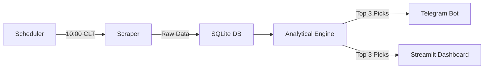

# � EGX Intelligence System

[](https://www.python.org/downloads/)
[](https://streamlit.io/)
[](https://t.me/egx67_bot)

A premium, fully automated intelligence pipeline designed for the **Egyptian Stock Exchange (EGX)**. This system identifies the **Top 3 High-Conviction investment opportunities** every morning before the market opens, delivering them straight to your Telegram.

---

## 🏗️ System Architecture



---

## 🧠 The Intelligence Logic

Our "Mean Reversion" strategy focuses on finding stocks that are mathematically **oversold** but showing signs of **institutional accumulation**.

### Step 1: The Filter (The "Buy the Dip" Test)
The system scans every stock in the EGX and applies a strict mathematical filter. It only keeps stocks where the **RSI (14) < 35**. This identifies stocks that have been pushed lower than their historical value.

### Step 2: The Ranking (The "Smart Money" Test)
Of the oversold stocks, we rank them by **Volume Spike**. We compute Today's Volume vs. the 10-day Average.
*   **A Volume Spike ≥ 1.5x** suggests big institutions are accumulating shares at the bottom.
*   We pick the **Top 3** stocks with the highest volume surge.

### Step 3: Risk Management
For every pick, the system automatically calculates:
-   💰 **Entry Price**: Current market price.
-   🎯 **Target Price**: +5.0% (Calculated take-profit).
-   🛑 **Stop-Loss**: -3.0% (Strict downside protection).

---

## 🚀 Getting Started

### 1. Installation
Clone the repository and install the dependencies:
```bash
pip install -r requirements.txt
```

### 2. Configuration
Open `config.py` to customize your thresholds or set your Telegram credentials:
```python
TELEGRAM_BOT_TOKEN = "your_token"
TELEGRAM_CHAT_ID   = "your_id"
```

### 3. Usage
| Action | Command | Description |
| :--- | :--- | :--- |
| **Manual Run** | `python core_engine.py` | Run the full pipeline immediately. |
| **Dashboard** | `streamlit run app.py` | Launch the visual web interface. |
| **Schedule** | `python scheduler.py` | Start the daily 10:00 AM automation. |

---

## 📊 Technical Indicators

| Indicator | Threshold | Rationale |
| :--- | :--- | :--- |
| **RSI (14)** | `< 35` | Mathematically "Cheap" / Reversal Candidate. |
| **Volume Spike** | `≥ 1.5×` | Relative surge suggesting institutional support. |
| **Profit Target** | `+5.0%` | Disciplined exit on strength. |
| **Stop-Loss** | `-3.0%` | Capital preservation on weakness. |

---

## 📂 Project Structure

-   `config.py`: Centralized settings & thresholds.
-   `scraper.py`: Cloudflare-resistant data acquisition.
-   `analyzer.py`: The RSI & Volume analysis engine.
-   `database.py`: SQLite persistence for historical tracking.
-   `telegram_bot.py`: Premium reporting & notifications.
-   `app.py`: Interactive Streamlit dashboard.
-   `scheduler.py`: Automated daily orchestration.

---

## ⚠️ Disclaimer
This tool is for **educational purposes only**. It does not constitute financial advice. Always consult a licensed financial advisor before making investment decisions. Trading in the stock market involves significant risk.

---
Built for the **Egyptian Market** 🇪🇬 · [Join the Telegram Channel](https://t.me/egx67_bot)
